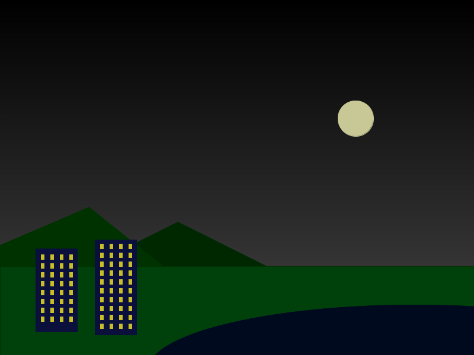
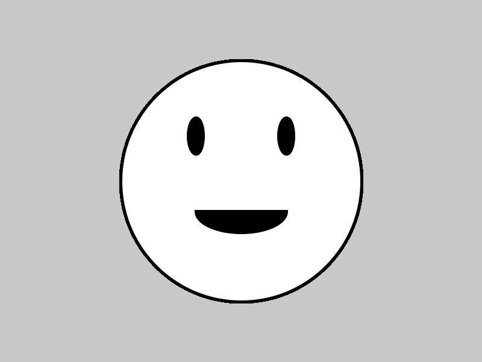

# Learning goals

* Understand the basic elements of a Processing program
* Understand how to run programs in the Processing environment
* Use Processing drawing functions to create images

# What to do

Your task is to use Processing to create a picture.

Start with the sketch you made on graph paper.  Note that the horizontal and vertical lines are marked with numbers: these will help you to determine the coordinates, widths, and heights to pass to the Processing drawing functions.

Note that in Processing, the origin (x=0, y=0) is in the upper left of the window, not the lower left.  Points closer to the bottom of the window have *larger* y coordinates, not smaller.

## An example

Here is an example image:

> 

Here is the Processing program that generated the image:

> [CityLights.pde](https://github.com/ycpcs/fys100-fall2015/blob/gh-pages/examples/CityLights.pde)

Feel free to use this program as a guide.  Note that this program uses a few advanced techniques, such as loops, methods, and color interpolation.  You do not need to use any of these features in your program.  However, when learning about programming, it is often helpful to use example programs as a source of inspiration and techniques to try out.

## Getting started

Start Processing.  Add the following code:


void setup() {
  background(200);
  size(800, 600);
}

void draw() {
  stroke(0);
  strokeWeight(5);
  fill(255);
  ellipse(400,300,400,400);
  fill(0);
  ellipse(325,225,25,60);
  ellipse(475,225,25,60);
  arc(400,350,150,70,0,PI,CHORD);
}


Click on the run button, which looks like this:

> 

When this program runs, you should see the following (click for larger image):

> 

Here is a quick explanation of the program.

The `setup` method executes when the program starts.  In the code above, `setup` sets the window size to 800x600, and sets the background color to 200, which is a light gray.

The `draw` function is executed automatically by Processing in order to display an image in the program's window.  In the above program, there are calls to `stroke` and `strokeWeight` to set the line drawing color (black) and thickness, `fill` to set a fill color (white initially, then black), `ellipse` to draw circles and ellipses, and `arc` to draw an arc (part of an ellipse).

## Colors

Colors in Processing can be specified in several ways.

A single integer value specifies a grayscale color, where 0 is black, 255 is white, and any value in between specifies a shade of gray.

Three integer values specify an RGB color, where the first integer specifies a red intensity, the second integer specifies a green intensity, and the third integer specifies a blue intensity.  As with the grayscale colors, the integers must be in the range 0&ndash;255, where 0 is the lowest intensity, and 255 is the highest.

One way to pick RGB color values is to use an online color picker, such as [colorpicker.com](http://www.colorpicker.com/).

Rather than specifying colors as numbers, you can also create color variables.  For example:


color windowGlow = color(200,190,40);


This line of code defines a color variable called `windowGlow` as a shade of yellow.  Once you have defined a color variable, you can use the name of that variable anywhere in the program where a color is expected (such as the `stroke` and `fill` functions.)

## Your task

Your task is to translate your graph paper sketch into Processing code.  By putting calls to the Processing drawing functions in your program's **draw** method, you can draw different kinds of shapes and lines.

The textbook and the [Processing Reference](https://processing.org/reference/) are good sources of information about what drawing functions are available, and how to use them.  Here is a quick guide to some useful functions.

stroke\(c) &mdash; set the current stroke (line-drawing) color to *c*

strokeWeight(w) &mdash; set the current stroke weight (line thickness) to *w*, where *w* is a number of pixels

fill\(c) &mdash; set the fill color to *c* (this is the color that fills the inside of shapes)

rect(x,y,w,h) &mdash; draw a rectangle whose upper-left corner is at *x*,*y* and whose width and height are *w* and *h*

ellipse(x,y,w,h) &mdash; draw an ellipse whose center is *x*,*y* and whose width and height are *w* and *h* (note that if *w* and *h* are equal, you get a circle)

line(x1,y2,x2,y2) &mdash; draw a line from *x1*,*y1* to *x2*,*y2*

triangle(x1,y1,x2,y2,x3,y3) &mdash; draw a triangle whose corners are at *x1*,*y1*, *x2*,*y2*, and *x3*,*y3*

Don't forget that when you use drawing functions, you will need to put a semicolon (;) character at the end of the line.

## Tips and tricks

Drawing functions are carried out in order: that means that lines/shapes added by later drawing operations are added on top of the lines/shapes added by earlier drawing operations.  This is a lot like painting, where you can layer new brush strokes on top of existing brush strokes.

It is perfectly fine, and sometimes quite useful, to have the program do drawing operations that are partially outside the window.  For example, the "city lights" example above draws a mostly-offscreen ellipse to serve as a body of water with a shoreline.

"Commenting out" sections of code is incredibly useful.  To temporarily disable a line of code, put the characters `//` at the beginning of the line.  To reenable the line, remove these characters.

If the code in your `draw` method is getting too complicated, you might find it useful to divide it into "helper" methods.  For example, this was the "smiley" `draw` method:


void draw() {
  stroke(0);
  strokeWeight(5);
  fill(255);
  ellipse(400,300,400,400);
  fill(0);
  ellipse(325,225,25,60);
  ellipse(475,225,25,60);
  arc(400,350,150,70,0,PI,CHORD);
}


We could split it up into helper methods as follows:


void draw() {
  drawHead();
  drawEyes();
  drawMouth();
}

void drawHead() {
  stroke(0);
  strokeWeight(5);
  fill(255);
  ellipse(400,300,400,400);
}

void drawEyes() {
  ellipse(325,225,25,60);
  ellipse(475,225,25,60);
}

void drawMouth() {
  fill(0);
  arc(400,350,150,70,0,PI,CHORD);
}


Note how the names of the helper methods add clarity to the program, because they each indicate what part of the drawing a particular sequence of drawing operations corresponds to.

Note that it may be necessary to add calls to `stroke`, `strokeWeight`, and `fill` to the helper methods, to make sure that the drawing operations they perform look the way they are supposed to.
