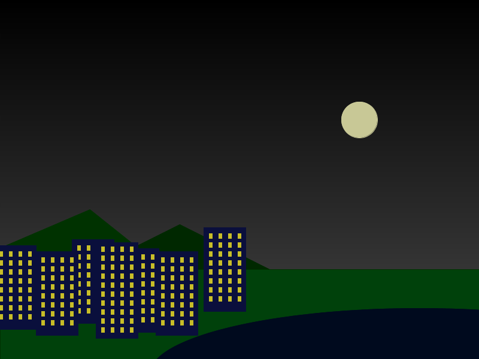

# Learning goals

* Use *procedural abstraction* to avoid repeated code when drawing similar or identical elements
* Use loops to avoid repeated code when the same drawing operation is being executed with coordinates and/or dimensions that vary in a predictable way

# What to do

Your task is to use methods and/or loops in your program to generate multiple copies of similar or identical elements in your image.

## Example: making a city

Consider the original "City Lights" image (click for full size):

> 

It's not really much of a city, since there are only two buildings!

Our goal will be to modify the program to generate more buildings, where each building is an exact copy of one of the two original buildings:

> 

### One approach: copy and paste

One approach to making multiple buildings would be to simple copy and paste the code that draws one building, and modify each instance.  For example, here is the original code to draw the first building:


color buildingColor = color(10, 15, 60);
color windowGlow = color(200,190,40);

// First building
fill(buildingColor);
stroke(buildingColor);
rect(60,420,70,140);

// rows of windows on first building
for (int r = 0; r < 8; r++) {
  stroke(windowGlow);
  fill(windowGlow);
  rect(69, 430+(r*15), 5, 8);
  rect(69+16, 430+(r*15), 5, 8);
  rect(69+16*2, 430+(r*15), 5, 8);
  rect(69+16*3, 430+(r*15), 5, 8);
}


We could generate an additional copy of the building by copy and pasting the drawing code, and changing the coordinate values to make it appear in a different place:


color buildingColor = color(10, 15, 60);
color windowGlow = color(200,190,40);

// First building
fill(buildingColor);
stroke(buildingColor);
rect(60,420,70,140);

// rows of windows on first building
for (int r = 0; r < 8; r++) {
  stroke(windowGlow);
  fill(windowGlow);
  rect(69, 430+(r*15), 5, 8);
  rect(69+16, 430+(r*15), 5, 8);
  rect(69+16*2, 430+(r*15), 5, 8);
  rect(69+16*3, 430+(r*15), 5, 8);
}

// First building (copy)
fill(buildingColor);
stroke(buildingColor);
rect(60+200,420,70,140);

// rows of windows on first building (copy)
for (int r = 0; r < 8; r++) {
  stroke(windowGlow);
  fill(windowGlow);
  rect(69+200, 430+(r*15), 5, 8);
  rect(69+200+16, 430+(r*15), 5, 8);
  rect(69+200+16*2, 430+(r*15), 5, 8);
  rect(69+200+16*3, 430+(r*15), 5, 8);
}


Notice how in the copy-and-pasted code, we added 200 to the x coordinate of each rectangle (the main rectangle, and the small rectangles used for the windows.)

This produces the following image (click for full size):

> 

This works, and is ok if we have only a small number of repeated elements.  However, copy and paste is tedious and error-prone if we have a larger number of repeated elements.  Wouldn't it be great if there were a way to use the same chunk of code to generate multiple copies of the same element?

### Better approach: procedural abstraction

Here is a modified version of the code to draw the first building:


color buildingColor = color(10, 15, 60);
color windowGlow = color(200,190,40);

int x = 60;  // x coordinate of left edge of building
int y = 420; // y coordinate of top edge of building

// First building
fill(buildingColor);
stroke(buildingColor);
rect(x,y,70,140);

// rows of windows on first building
for (int r = 0; r < 8; r++) {
  stroke(windowGlow);
  fill(windowGlow);
  rect(x+9, y+10+(r*15), 5, 8);
  rect(x+9+16, y+10+(r*15), 5, 8);
  rect(x+9+16*2, y+10+(r*15), 5, 8);
  rect(x+9+16*3, y+10+(r*15), 5, 8);
}


This code accomplishes exactly the same thing as the original code.  The only difference is that rather than "hard-coding" the x coordinate of each rectangle, we introduced a variables called `x` and `y`, which represent the x coordinate of the left edge of the building and the y coordinate of the top edge of the building.  The code sets these variables to 60 and 420, respectively, which leads to drawing the building in precisely the same place as the original version of the code.  However, there is no reason why `x` and `y` couldn't be set to other values.  By changing the value of `x` and/or `y`, we can put buildings anywhere in the drawing!

What we have done here is to *generalize* the code to draw the first building by introducing *parameters* called `x` and `y` that represent the horizontal and vertical position of the building.  "Parameter" simply means a quantity used in a chunk of code, where we want to allow the quantity to vary.  In the code above, the values of `x` and `y` are still fixed, so we haven't really achieved a fully general way to draw arbitrary copies of the building in arbitrary positions.  To do that, we need to create a method:


void drawBuildingOne(int x, int y) { // <-- x and y are parameters!
  color buildingColor = color(10, 15, 60);
  color windowGlow = color(200,190,40);
  
  // First building
  fill(buildingColor);
  stroke(buildingColor);
  rect(x,y,70,140);
  
  // rows of windows on first building
  for (int r = 0; r < 8; r++) {
    stroke(windowGlow);
    fill(windowGlow);
    rect(x+9, y+10+(r*15), 5, 8);
    rect(x+9+16, y+10+(r*15), 5, 8);
    rect(x+9+16*2, y+10+(r*15), 5, 8);
    rect(x+9+16*3, y+10+(r*15), 5, 8);
  }
}


A method is a "generic" chunk of code that can be *called* from anywhere in the program.  The parameters to the method (in this case `x` and `y`) are variables whose values can be specified arbitrarily for each call: in other words, one call to the method might specify `x` as 60 and `y` as 420, while another might specify `x` as 260 and `y` as 420.

In fact, let's do precisely that, by modifying the `drawBuildings` method to call the `drawBuildingOne` method:


void drawBuildings() {
  // Draw two copies of building one, using the
  // drawBuildingOne method
  drawBuildingOne(60,420);   // use x=60,y=420 for this copy
  drawBuildingOne(260,420);  // use x=260,y=420 for this copy

  color buildingColor = color(10, 15, 60);
  color windowGlow = color(200,190,40);

  // Second building
  fill(buildingColor);
  stroke(buildingColor);
  rect(160,405,70,160);
  
  // rows of windows on the second building
  for (int r = 0; r < 10; r++) {
    stroke(windowGlow);
    fill(windowGlow);
    rect(169, 412+r*15, 5, 8);
    rect(169+16, 412+r*15, 5, 8);
    rect(169+16*2, 412+r*15, 5, 8);
    rect(169+16*3, 412+r*15, 5, 8);
  }
}


Because `drawBuildingOne` allows us to specify values for the `x` and `y` parameters, we can draw the same building in two places.  Note that we left the code for drawing the second (taller) building unchanged.

The beauty of the `drawBuildingOne` method is that we can call it as many times as we want!  Here's an expanded version of `drawBuildings`:


void drawBuildings() {
  drawBuildingOne(-10,410);  // use x=-10,y=410 for this copy
  drawBuildingOne(120,400);  // use x=120,y=400 for this copy
  drawBuildingOne(60,420);   // use x=60,y=420 for this copy
  drawBuildingOne(195,415);  // use x=195,y=415 for this copy
  drawBuildingOne(260,420);  // use x=260,y=420 for this copy
  drawBuildingOne(340,380);  // use x=340,y=380 for this copy

  color buildingColor = color(10, 15, 60);
  color windowGlow = color(200,190,40);

  // Second building
  fill(buildingColor);
  stroke(buildingColor);
  rect(160,405,70,160);
  
  // rows of windows on the second building
  for (int r = 0; r < 10; r++) {
    stroke(windowGlow);
    fill(windowGlow);
    rect(169, 412+r*15, 5, 8);
    rect(169+16, 412+r*15, 5, 8);
    rect(169+16*2, 412+r*15, 5, 8);
    rect(169+16*3, 412+r*15, 5, 8);
  }
}


This produces the following image (click for full size):

> 

That looks more like a city!

Here is the complete program: [CityLights2.pde](https://github.com/ycpcs/fys100-fall2015/blob/gh-pages/examples/CityLights2.pde)
