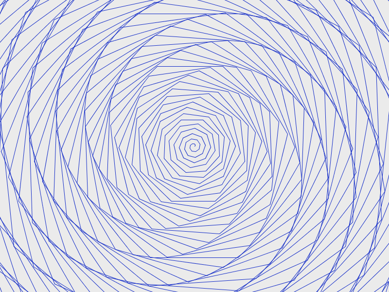
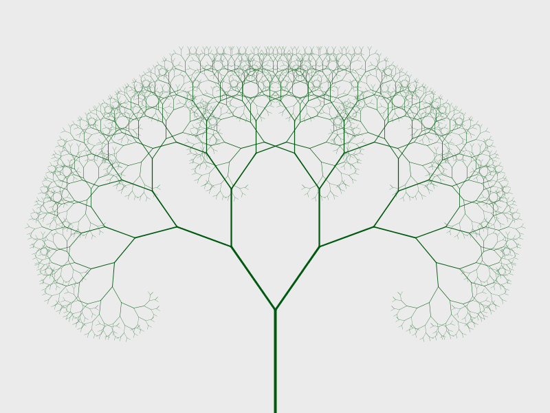

> *Big fleas have little fleas,* *Upon their backs to bite 'em,* *And little fleas have lesser fleas,* *and so, ad infinitum.*

# Learning goals

* Use turtle graphics to generate images from simple rules
* Appreciate how self-similarity at varying scales leads to "natural"-looking images
* Understand how to use a recursive method to generate a fractal image

# Getting started

To run the example programs in this lab, you will need to add the [Terrapin](http://terrapin.sourceforge.net/) library to your Processing sketchbook.  Here is how to do this on Windows (for example, in KEC 123):

* Download [Terrapin.zip](../media/Terrapin.zip) and save it somewhere (such as your Downloads folder)
* Open a file browser window, navigate into the folder where you saved Terrapin.zip
* Right-click on Terrapin.zip, and choose **Extract**
* Change the target directory to the **libraries** folder within your sketchbook directory (which is most likely the **sketchbook** directory in your H: drive)
* Choose **Extract all**

Start Processing.  Choose **Sketch** &rarr; **Import library...** &rarr; **Terrapin**.  You should see the code


import terrapin.*;


in the text editor.  This line lets Processing know that you will be using the Terrapin library in your program.

# What to do

Your task is to use turtle graphics to draw cool-looking images, and in particular, fractal images.

That's really the only task!  Just mess around and see if you can create some interesting images by modifying and extending some of the examples shown below.  Don't forget to save your favorite programs in your Processing sketchbook folder.

## Turtles

[Turtle graphics](https://en.wikipedia.org/wiki/Turtle_graphics) were invented as part of the [Logo](https://en.wikipedia.org/wiki/Logo_(programming_language) programming language.

The basic idea is that your program controls one or more "turtles".  Each turtle has a position (and y coordinates), and an orientation (the angle specifying which way the turtle is facing.)  The program can give commands to the turtle: the most important commands are to instruct the turtle to move forward by a specified distance, and to rotate left or right.

Each turtle has a "pen".  The pen can be up or down.  If a turtle moves forward, and if the turtle's pen is down, then the turtle draws a line from its original position to its new position.  The color of the pen can be modified, allowing line segments to be drawn in a variety of colors.

## First example

Here is a simple example:


import terrapin.*;

void setup() {
  size(800,600);
  background(235);
  noLoop();
}

void draw() {
  Terrapin t = new Terrapin(this);
  t.setLocation(400,300);
  
  t.setPenColor(15,40,199);
  
  for (int i = 0; i < 500; i++) { // repeat 500 times
    t.forward(i);
    t.left(44);
  }
}


This example produces the following output (click for full size):

> 

So, what is going on here?

* The `setup` method sets the window size and background color, and uses `noLoop` so that the `draw` method is only executed once (this produces better image quality when the image consists of lines)
* The `draw` method creates a Terrapin (turtle), sets its location to 400,300 (at the center of the window), and sets its pen color to a shade of blue
* The for loop repeats, for values of the variable `i` from 0 to 499: move forward `i` pixels of distance, and then turn left 44 degrees

Try modifying this program.  What happens if you change the amount by which the turtle moves forward at each step?  (Try `i*2` instead of `i`.)  What happens if you change the turn angle to make it larger or smaller?  What happens if you use the `right` command instead of `left`?

## A fractal tree

Here is an example of a fractal:


import terrapin.*;

float startLen = 150;
float decay = .75;
int angle = 35;

void setup() {
  size(800, 600);
  background(235);
  noLoop();
}

void draw() {
  Terrapin t = new Terrapin(this);
  t.setLocation(400,600);
  t.setRotation(270);
  t.setPenColor(0,89,14);
  
  drawTree(t, startLen);
}

void drawTree(Terrapin t, float dist) {
  if (dist > 5) {
    strokeWeight(4 * (dist/startLen));
    
    t.forward((int)dist);
    
    Terrapin copy = new Terrapin(t);
    
    t.left(angle);
    copy.right(angle);
    
    drawTree(t, dist * decay);
    drawTree(copy, dist * decay);
  }
}


This produces the following image (click for full size):

> 

Let's analyze this program.

At the top of the program, we define some _global variables_.  These are variables that are visible throughout the program.  The `startLen` variable defines the length of the first tree segment.  The `decay` variable controls how rapidly the length of the tree segments decreases as more segments are added.  The `angle` variable controls the angle of the "branches".

The `setup` method is the same as the previous program: it just sets the window size, background color, and calls `noLoop` to specify that the `draw` method should only be executed once.

The `draw` method creates an initial Terrapin (turtle), positions it at the bottom of the window, and orients it so that it is pointing straight up.  It also sets the drawing color to a shade of green.  Finally, it calls the `drawTree` method with the initial Terrapin and initial segment length as parameters.

The `drawTree` method is where the interesting stuff happens.  The `if` construct checks to see if the `dist` parameter is greater than 5: if not, then the method does nothing.  If `dist` is greater than 5, then the method moves the Terrapin `t` forward by `dist` number of pixels.  (Note that it is necessary to convert `dist` to an integer value.)  Next it creates a copy of the Terrapin `t`, called `copy`.  Both Terrapins (`t` and `copy`) are rotated by `angle` number of degrees, but in opposite directions.  Finally, the `drawTree` method is called with Terrapins `t` and `copy`, and with the `dist` parameter set to `dist * decay`.

Wait...what?

The `drawTree` method uses a technique called _recursion_.  The idea is that to draw a tree, we use a single turtle to draw an initial segment, and then "split" into two separate turtles, each oriented at a different angle, and then use these two turtles to draw *slightly smaller trees*.  In other words: a tree is a segment (you can think of this as the trunk, or a branch) that splits into two smaller trees.  However, these smaller trees _are formed in exactly the same way as the overall tree_.  Since the `drawTree` method draws a tree (whose size is based on the value of the `dist` parameter), it makes sense for the `drawTree` method to _call itself_ to draw the smaller trees.

In programming, recursion only works if it "bottoms out" at some point.  That is the purpose of the `if` construct: once the segment length (`dist`) falls below a specified minimum threshold, the process stops.  You can think of this as occurring at the "leaves" of the tree.  Without the `if` construct, the recursion would never "finish".

Try experimenting with this program.  What happens if you change the values of the `startLen`, `decay`, and/or `angle` variables?  What happens if you use a minimum segment length threshold other than 5?
