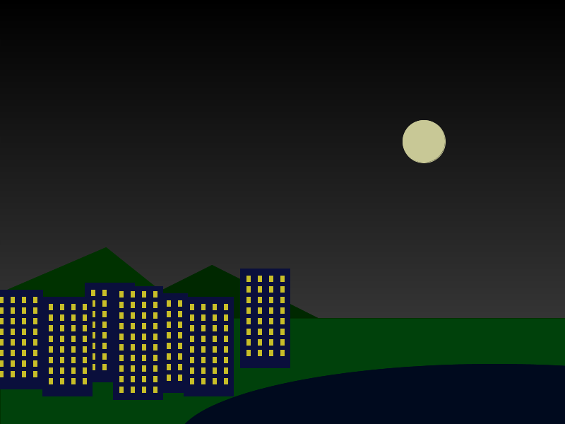

# Learning goals

* Animate elements of an image by varying their positions, sizes, and/or colors over time

# What to do

Your task is to animate one or more elements of your image.

This task will depend on having a method with x and/or y parameters that draws an element at a specified position: see [Lab 2](lab02.html).

The following example illustrates how to do this.

## The building has landed

The example image from [Lab 2](lab02.html) seems like a peaceful city scene (click for full size):

> 

You may not have realized that there is a backstory: one of the buildings is not a building at all.  It's actually an alien spaceship! Click the link below to see the animation:

> [Building animation](code/building.html)

## Animation basics

The basic principle of animation is very straightforward: the program should draw a series of slightly different images, with small delay between each image.  If the delay between images is small, our eyes will perceive the changes between images as motion.

Processing is designed for animation: by default, your program's `draw` method is called 10 times per second.  So, if each time `draw` executes it draws a slightly different scene, we have animation!  We will refer to the slightly different images drawn by the `draw` method as the program executes as *frames*.

To animate a single element of the image, as we did in the building animation, all we need to do is draw the element in a different position in each frame.  The perceived motion of the element will depend on how the element's position is changing.  In the building example, we wanted the building to move from the top of the scene towards the bottom.  So, we need to make the moving building's y coordinate increase.

Doing this is simple: we can add a *global variable* to the program to keep track of where the moving building should be displayed.  Our global variable will look like this:


int buildingY = -140;


It is a global variable as long as we define it outside any of the program's methods.  Global variables are "visible" to *all* of the methods in the program, so they can be referred to in any method.  Note that for this global variable, we have defined it as an `int` (integer), and given it an initial value (-140).

To implement the animation, we just need to make two small changes to the program.  First, in the `drawBuildings` method, we will change the line of code that calls the `drawBuildingOne` method to draw the animated building.  This is the original line of code:


drawBuildingOne(120,400);  // use x=120,y=400 for this copy


We will change it as follows:


drawBuildingOne(120,buildingY);  // this is the moving building!


Note that rather than drawing the building at a fixed y coordinate, we specify its y coordinate as whatever the current value of the `buildingY` variable is.

The last change we need to make is that the value of `buildingY` needs to be updated for each frame of the animation.  This is easily accomplished by adding some code to the beginning of the `drawBuildings` method, which is executed once per frame (because it is called by the `draw` method).  We will add the following code to the top of the method:


if (buildingY < 400) {
  buildingY++;
}


This code uses an `if` construct to check whether `buildingY` is less than 400.  If it is, then it increases the value of `buildingY` by 1.  (That is what the `++` does.)  The purpose of the `if` construct is to make the building stop moving when `buildingY` reaches 400.  If we didn't do this, the building would keep moving down indefinitely, and eventually move past the bottom of the scene.

Here is the complete code: [CityLightsAnimation.pde](https://github.com/ycpcs/fys100-fall2015/blob/gh-pages/labs/code/CityLightsAnimation.pde)

## Other possibilities

The example above is a simple one.  There are many more possible ways to add animated elements to your program:

* You can change an element's x coordinate to produce horizontal motion
* You can change an element's x and y coordinates at the same time to produce diagonal motion (note that you will need two global variables to allow this)
* Rather than changing the position of an element, you could change a dimension (width or height) or color, if the method that draws the element has parameters to control those aspects of the element

## Using arrays to control many elements at once

If you are animating multiple elements, you will need at least one global variable per element.  Using and updating multiple variables can become tedious and error-prone.

An *array* is a sequence of variables.  The variables in an array are called the *elements* of the array, and each array element is referred to using an integer index.  The first element in an array has index 0, the second has index 1, etc.

Here is how we might use arrays to animate all of the buildings (except for the original second building, which we'll leave where it is.)

First, we'll declare two global arrays to keep track of

* The current y coordinate of each animated building
* The "stop" y coordinate of each building (basically, each building's final y coordinate when it "lands")

Here are the global arrays:


int[] buildingY = { -200, -320, -175, -240, -190, -210 };
int[] stopY = { 410, 400, 420, 415, 420, 380 };


Note how there are 6 elements in each array, one for each building.  The `buildingY` array serves the same purpose that the `buildingY` variable did in the previous animation, except that now it can keep track of the positions of 6 buildings rather than just one building.  The `stopY` array keeps track of where each building should stop: this allows each building to stop moving at a different position.

Now we just need code to

* Update the elements of the `buildingY` array in order to make the building positions change from frame to frame
* Use the elements of the `buildingY` array to control the positions of the buildings

We can add code to the `drawBuildings` method to accomplish both of these:


for (int i = 0; i < buildingY.length; i++) {
  if (buildingY[i] < stopY[i]) {
    buildingY[i]++;
  }
}
  
drawBuildingOne(-10,buildingY[0]);
drawBuildingOne(120,buildingY[1]);
drawBuildingOne(60,buildingY[2]);
drawBuildingOne(195,buildingY[3]);
drawBuildingOne(260,buildingY[4]);
drawBuildingOne(340,buildingY[5]);


The `for` loop checks each building's y coordinate (`i` is an index to select an element, first 0, then 1, etc.) and increases the building's y coordinate if the y coordinate has not yet reached the stop value.

The calls to `drawBuildingOne` are the same as before, except that instead of hard-coded y coordinate values, the y coordinate values are taken from the values of the elements of the `buildingY` array.

Click the following link to see the updated animation:

> [Multiple building animation](code/multi-building.html)

Here is the complete code: [CityLightsAnimation2.pde](https://github.com/ycpcs/fys100-fall2015/blob/gh-pages/labs/code/CityLightsAnimation2.pde)
