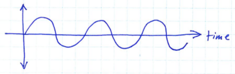
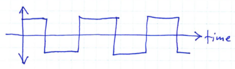
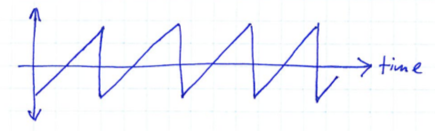
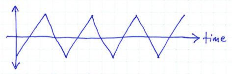
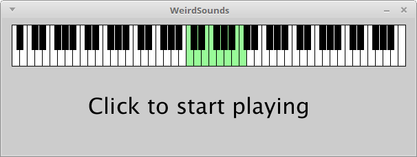

# Learning goals

* Experiment with basic waveforms
* Experiment with audio effects
* Play notes live, capture them, and add them to a composition

# What to do

First, read the *What is sound?* section.

Next, do the experiments in the *Experiments* section.

## What is sound?

<b>Important</b>: Before you try playing any of the sound samples below, adjust the system volume control on the computer you are using so that it is on a low setting.

Sound is caused by rapid vibrations, or *oscillations*, in physical objects.  These oscillations cause rapid changes in air pressure over time.

Sounds can be characterized by the *rate* at which the changes in air pressure occur.  For example, let's say that a vibration causes air pressure to increase and decrease at a rate of 440 changes per second: in other words, 440 times per second, the air pressure increases and then decreases.  We would describe this sound as having a *frequency* of 440 Hertz, abbreviated 440 Hz.

Sounds with lower frequencies sound "low", and sounds with higher frequencies sound "high".  The lowest frequency that we can hear is about 20 Hz, while the highest frequency we can hear is about 20,000 Hz.

The most fundamental kind of oscillation is the *sine wave*:

> 

The diagram above is a plot of air pressure over time, where the x-axis is time, and the y-axis is pressure relative to the average air pressure.  Points above the x-axis represent air pressure higher than the current average, and points below the x-axis represent air pressure lower than the current average.

Sine waves tend to occur naturally due to the way physical objects vibrate.  A pure sine wave represents a single clear tone.  For example, here is a sample of a 440 Hz sine wave:

> <iframe width="500" height="166" scrolling="no" frameborder="no" src="https://w.soundcloud.com/player/?url=https%3A//api.soundcloud.com/tracks/225567736&amp;color=ff5500&amp;auto_play=false&amp;hide_related=false&amp;show_comments=true&amp;show_user=true&amp;show_reposts=false&amp;show_artwork=false"></iframe>

A sound consisting of a single sine wave tends to sound very artificial because sounds arising from the vibration of physical objects tend to have *overtones*, which are vibrations occuring at a multiple of the sound's base frequency.  For example, when an instrument string vibrates, the length of the string will determine the base frequency, but overtones will occur which are twice the base frequency, three times the base frequency, four times the base frequency, etc.

Here is a sample of a 440 Hz sine wave, along with some overtones:

> <iframe width="500" height="166" scrolling="no" frameborder="no" src="https://w.soundcloud.com/player/?url=https%3A//api.soundcloud.com/tracks/225569272&amp;color=ff5500&amp;auto_play=false&amp;hide_related=false&amp;show_comments=true&amp;show_user=true&amp;show_reposts=false&amp;show_artwork=false"></iframe>

Note that in the audio sample above, the relative volume of the overtone frequencies has been lowered relative to the volume of the base frequency.

It turns out that *any* sound imaginable can be created by combining sine waves.  All of the sounds that you hear are combinations of sine waves with varying frequencies and volumes.

## Electronic waveforms

Electronic instruments, such as synthesizers and computers with sound output hardware, are not limited to creating pure sine waves.  In fact, it tends to be easier for digital devices to generate "artificial" sound waveforms.  Here are some examples of commonly-used electronic waveforms.

A square wave is characterized by abrupt transitions between low to high pressure:

>  

Here is a sample of a 440 Hz square wave:

> <iframe width="500" height="166" scrolling="no" frameborder="no" src="https://w.soundcloud.com/player/?url=https%3A//api.soundcloud.com/tracks/225567893&amp;color=ff5500&amp;auto_play=false&amp;hide_related=false&amp;show_comments=true&amp;show_user=true&amp;show_reposts=false&amp;show_artwork=false"></iframe>

A square wave has a more complex sound than a sine wave of the same frequency.  The shape of the waveform results in [higher frequency overtones at odd multiples of the base frequency](http://www.embedded.com/print/4015870).

Another common electronic waveform is the sawtooth wave, characterized by a linear rise and an abrupt fall in pressure during each oscillation:

> 

Here is a sample of a 440 Hz sawtooth wave:

> <iframe width="500" height="166" scrolling="no" frameborder="no" src="https://w.soundcloud.com/player/?url=https%3A//api.soundcloud.com/tracks/225567809&amp;color=ff5500&amp;auto_play=false&amp;hide_related=false&amp;show_comments=true&amp;show_user=true&amp;show_reposts=false&amp;show_artwork=false"></iframe>

Again, the sawtooth wave has a more complex sound than a sine wave of the same frequency.

A triangle wave is like a sawtooth wave, except rather than having an abrupt fall, the fall is pressure linear:

> 

Here is a sample of a 440 Hz triangle wave:

> <iframe width="500" height="166" scrolling="no" frameborder="no" src="https://w.soundcloud.com/player/?url=https%3A//api.soundcloud.com/tracks/225567949&amp;color=ff5500&amp;auto_play=false&amp;hide_related=false&amp;show_comments=true&amp;show_user=true&amp;show_reposts=false&amp;show_artwork=false"></iframe>

The sound of a triangle wave is similar to a square wave.

## Experiments

<b>Important</b>: Before you try creating sounds with the processing sketch, adjust the system volume control on the computer you are using so that it is on a low setting.

Your task is to experiment with playing notes using basic waveforms.

The first thing you will need to do is install the [FunWithSound](https://github.com/daveho/FunWithSound) Processing library.  The steps will be similar to what you did to install the [Terrapin](http://terrapin.sourceforge.net/) library in [Lab 3](lab03.html).  Here is what you should do:

* In Processing, choose **File&rarr;Preferences**, and verify that your sketchbook folder is set to whichever folder you are using to save your Processing programs; if it is not set correctly, change it
* Download [FunWithSound.zip](https://github.com/daveho/FunWithSound/releases/download/v1.0.4/FunWithSound.zip) and save it somewhere (such as your Downloads folder)
* Open a file browser window, navigate into the folder where you saved FunWithSound.zip
* Right-click on FunWithSound.zip, and choose **Extract All**
* Change the target directory to the **libraries** folder within your sketchbook directory (again, whichever folder you configured in your Preferences)
* Choose **Extract**
* Quit Processing and then restart it

When you restart Processing, and choose **Sketch&rarr;Import Library...**, you should see **FunWithSound** listed as one of the options.

Once the FunWithSound library is installed, copy and paste all of the code from [WeirdSounds.pde](https://github.com/ycpcs/fys100-fall2015/blob/gh-pages/examples/WeirdSounds.pde) into the Processing editor.  Run the sketch by pressing the play button.  You should see the following window:

> 

If you click the mouse somewhere in the window, you should hear a repeated tapping sound.  This is a very basic rhythm pattern (you will experiment with rhythms in [Lab 6](lab06.html).)  The tapping sound will end in a short time.  You can click in the window again to restart it.

While the rhythm pattern is playing, you can use the following keyboard keys to play notes:

> 

Note that you can only play notes from one octave: the current octave is highlighted in green in the picture of the piano keyboard you see in the window.  You can use the up and down arrow keys to move the current octave higher or lower.

Now you can try some experiments!  If you scroll down to the bottom of the Processing code, you will see a method called `registerCustomInstruments`.  This method configures FunWithSound to play notes using the basic waveforms described earlier.  You will see comments labeled "Custom instrument 0", "Custom instrument 1", "Custom instrument 2", etc.  Some of the experiments will involve changing these instrument definitions to produce different sounds.  Also, note how there are comments such as


// <-- try Buffer.SQUARE, Buffer.SAW, Buffer.TRIANGLE


on some lines of code.  These comments highlight changes you can make to change the note sounds.

Note: if you change the code, you will need to restart sketch in order for your changes to take effect.

### Experiment 1: Basic synth sounds

Find the section of `registerCustomInstruments` that defines custom instrument 0.  Note how the code uses `Buffer.SINE`.  This causes notes to be played as a sine wave.  Try changing this as described in the comment to use square, sawtooth, and triangle waves.  Which waveform is your favorite?

### Experiment 2: Using a note envelope

One thing that you will notice about custom instrument 0 is that the note sounds turn on and off very abruptly.  Rapid changes in volume tend to produce a clicking or popping sound.  These pops can be avoided by playing the notes with an *envelope*.  When a note envelope is used, notes start playing with a rise in volume over a specified *attack time*, and stop playing with a lowering of volume over a specified *release time*.

At the top of the program, change the line


Instrument synth = custom(0); // <-- change this to select among the custom instruments


to


Instrument synth = custom(1); // <-- change this to select among the custom instruments


Try restarting the program and playing some notes.  Note how the notes sound more natural.

In the section of `registerCustomInstruments` that defines custom instrument 1, you can adjust the attack time and release time parameters to change the note envelope.  These times are specified in milliseconds: for example, 100 milliseconds is one tenth of one second.

### Experiment 3: Portamento

*Portamento* describes the effect of "gliding" from note to note by changing the sound frequency somewhat gradually.  Using custom instrument 1, try changing the glide time parameter to a value other than 0.  The glide time is specified in milliseconds.  Suggestion: try values such as 40, 80, 100, and 200.

### Experiment 4: Overtones

Most "natural" sounds consist of multiple simultaneous frequencies.  You can change custom instrument 2 to define multiple frequencies to sound each time a note is played.  Look for the following lines:


new double[]{ 1.0, 1.5, 2.0 }, // <-- try changing the multiples, adding new multiples
new double[]{ 1.0, 0.5, 0.25 } // <-- try changing the gains (volumes)


The numbers in the first line define multiples of the base note frequency.  The values 1.0, 1.5, and 2.0 correspond to the base note frequency, one and a half times the note frequency, and twice the note frequency.

The numbers in the first line define the "gains" of each frequency multiple.  1.0 means full volume, while 0.0 means complete silence.

By combining frequencies at different volumes, you can change the note sound considerably.  Try other combinations of frequency multiples and gains.  For example, try the multiples .5, 1.0, and 2.0.  Try "random" multiples, for example, 1.0, 1.89, and 2.354.  Note that you can have more than three multiples and gains, but you should always have the same number of multiples and gains.

Make sure that you try different waveforms (including square, saw, and triangle).

### Experiment 5: Effects

Another way to change the sound of a synthesized instrument is to add *effects*.  Here are some effects you can try.

*Reverb* is an effect that simulates sound bouncing around inside a large space.  To use reverb, remove the `//` comment marker from the following, towards the top of the program where the instrument is defined:


//addfx(synth, new AddReverb()); // <-- uncomment this line to add reverb


Try playing some notes with the reverb effect.

FunWithSound allows multiple effects to be added to the same instrument.  Here are some other effects you can try, individually, or in combination:


// Flanger effect
addfx(synth, new AddFlanger());

// Delay effect: creates a clear "echo" of the played sound
addfx(synth, new AddDelay(400.0, 1.0, 0.6)); // 400ms delay, delayed echo at 60% volume

// Chained delays: create multiple echoes
addfx(synth, new AddDelay(400.0, 1.0, 0.6));
addfx(synth, new AddDelay(800.0, 1.0, 0.5));
addfx(synth, new AddDelay(1200.0, 1.0, 0.4));

// Autopan effect: pan the sound between left and right channels
addfx(synth, new AddAutoPan(.5, -.8, .8)); // .5 Hz (one full pan every 2 seconds), 80% stereo separation

// Ping pong stereo delays: create echoes that alternate between
// left and right channels
Params ppdParams = AddPingPongStereoDelays.defaultParams();
ppdParams.put(ParamNames.NUM_DELAYS, 4); // number of delays
ppdParams.put(ParamNames.DELAY_MS, 250); // number of milliseconds between delays
addfx(synth, new AddPingPongStereoDelays(ppdParams));


### Experiment 6: Playback

You may have noticed that when you play notes live, and then the metronome sounds end, the program prints some code in the Processing output view (just below the program source code.)  For example, here is some output from notes I played:


Rhythm rhythm = r(
	s(0.000,1.037,96), s(2.114,1.072,96), s(4.153,0.459,93), s(4.608,0.665,75), s(5.768,0.535,90), s(6.795,0.452,93), s(7.103,0.611,72));
Melody melody = m(
	an(38), an(38), an(38), an(45), an(43), an(43), an(36));


You can copy these lines into your program so that they become a permanent part of the composition.  Here is how.

First, you will probably want to create a new instrument for the replayed notes.  You can copy and paste the code that creates the `synth` instrument, and then rename it (e.g., as `synth2`):


    Instrument synth2 = custom(1);
    addfx(synth2, new AddReverb());
    v(synth2, 0.2); // reduce the volume


Then, just below the code that defines the metronome pattern, copy and paste the code for the captured notes, and rename the variables to something other than "rhythm" and "melody":


Rhythm bassr = r(
	s(0.000,1.037,96), s(2.114,1.072,96), s(4.153,0.459,93), s(4.608,0.665,75), s(5.768,0.535,90), s(6.795,0.452,93), s(7.103,0.611,72));
Melody bassm = m(
	an(38), an(38), an(38), an(45), an(43), an(43), an(36));


Next, just below those lines, create a line that defines a `Figure` variable which plays your captured rhythm and melody with the instrument you created:


Figure bassf = f(bassr, bassm, synth2);


A figure uses an instrument to play a melody using a specified rhythm.

Finally, change some of the calls to `add1` so that your new figure is played at the same time as the metronome pattern:


add1(gf(metf,bassf));
add1(gf(metf,bassf));
add1(gf(metf,bassf));
add1(gf(metf,bassf));


Here is a recording of the result:

> <iframe width="500" height="166" scrolling="no" frameborder="no" src="https://w.soundcloud.com/player/?url=https%3A//api.soundcloud.com/tracks/225978643&amp;color=ff5500&amp;auto_play=false&amp;hide_related=false&amp;show_comments=true&amp;show_user=true&amp;show_reposts=false&amp;show_artwork=false"></iframe>

At this point you can see how we could build a composition: by recording small pieces of the composition, defining them using rhythms, melodies, and figures, and specifying when they should be played.
