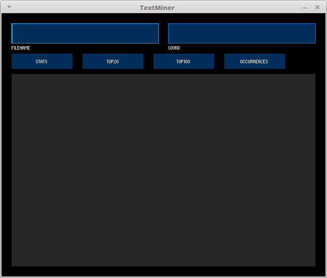
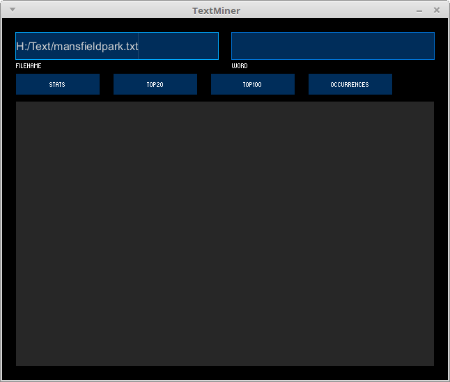
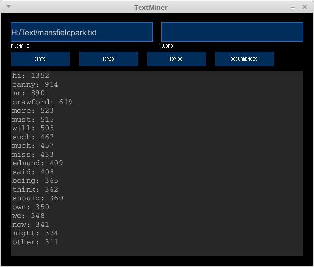

# Learning goals

* Find word usage patterns in a text
* Create and test a hypothesis using automated text analysis

# What to do

First, follow the steps in the *Installing controlP5*.

Next, read the *Text mining* section.

Finally, create and test a hypothesis as described in the *Experiment* section.

## Installing controlP5

The program we will be using to analyze texts requres the [controlP5]() Processing library.

First, download [controlP5-2.2.5.zip](https://github.com/sojamo/controlp5/releases/download/v2.2.5/controlP5-2.2.5.zip) and save it somewhere (e.g., your downloads folder.)

Next, right-click on the saved zipfile and choose **Extract all**.

As the output folder, choose the `libraries` folder in your Processing sketchbook folder.  Click **Extract**.

If Processing is running, restart it.  When you select **Sketch &rarr; Import Library...** from the menu, you should see **ControlP5** as an option.

## Text mining

Copy and paste the following code into an empty Processing sketch:

> [TextMiner.pde](https://github.com/ycpcs/fys100-fall2015/blob/gh-pages/examples/TextMiner.pde)

Run the program.  You should see the following window (click for full size):

> 

This program allows you to do some very basic analysis of word usage in a text.  Start by downloading a text from the [Project Gutenberg](https://www.gutenberg.org/) website, which is a repository of public domain books.  Make sure that you choose the **Plain Text UTF-8** download.  For example, I chose [Mansfield Park](https://www.gutenberg.org/ebooks/141) by Jane Austen.  When you save the text, save it using a folder and filename you will remember: I saved files in a `Text` folder in my `H:` drive, and saved the file as `mansfieldpark.txt`.

Start by entering the filename of the text you want to analyze in the `FILENAME` box (click for full size):

> 

Once you have entered the filename, you can click one of the buttons to analyze the text:

* `STATS` shows you how many words are in the text
* `TOP20` shows you the 20 most-frequently occurring words
* `TOP100` shows you the 100 most-frequently occurring words
* `OCCURRENCES` shows you the number of times the word you enter in the `WORD` textbox occurs in the text

For example, here is what is shown when clicking `TOP20` for Mansfield Park:

> 

Note that there are a few quirks:

* The program assumes that any word ending in "ies", "es", or "s" is a plural, and attempts to convert it to singular; this conversion may not be correct for some words
* The program ignores "boring" words: these are defined in the program's `setup` function; you may want to add additional boring words to the list

## Experiment

Think of a hypothesis about literary works available from Project Gutenberg that can be tested by analyzing word frequencies.

Here is an example:

> Dickens's later novels are "darker" than his earlier novels, so words evoking darkness or sadness should be relatively more frequent in his later works that his earlier works

Let's test this hypothesis by comparing word usage in The Pickwick Papers (1836) with Great Expectations (1860).

First, these are the total word counts for each novel:

> Book | Word count
> ---- | ----------
> The Pickwick Papers | 301,948
> Great Expectations | 187,364

Let's look for occurrences of the words "dark" and "sad"/"sadness".  Note that we don't want to compare the absolute numbers of occurrences, since the two novels have different numbers of words.  Instead, we'll compare the occurrence frequency of the words we're interested in by dividing the occurrence count by the total number of words.

> Book | "Dark" | "Dark" freq. | "Sad" or "sadness" | "Sad" or "sadness" freq.
> ---- | ------ | ------------ | ------------------ | ------------------------
> The Pickwick Papers | 64 | .000211 | 7 | .000023
> Great Expectations | 68 | .000362 | 5 | .000026

The word "dark" appears much more frequently in Great Expectations than The Pickwick Papers, supporting our hypothesis.  The words "sad" and "sadness" occur with about the same frequency in each novel.

Create a document called `Text mining experiment` in your shared Google Drive folder.  State your hypothesis and record data to test your hypothesis.  Finally, analyze the data and state whether or not it supports your hypothesis.
