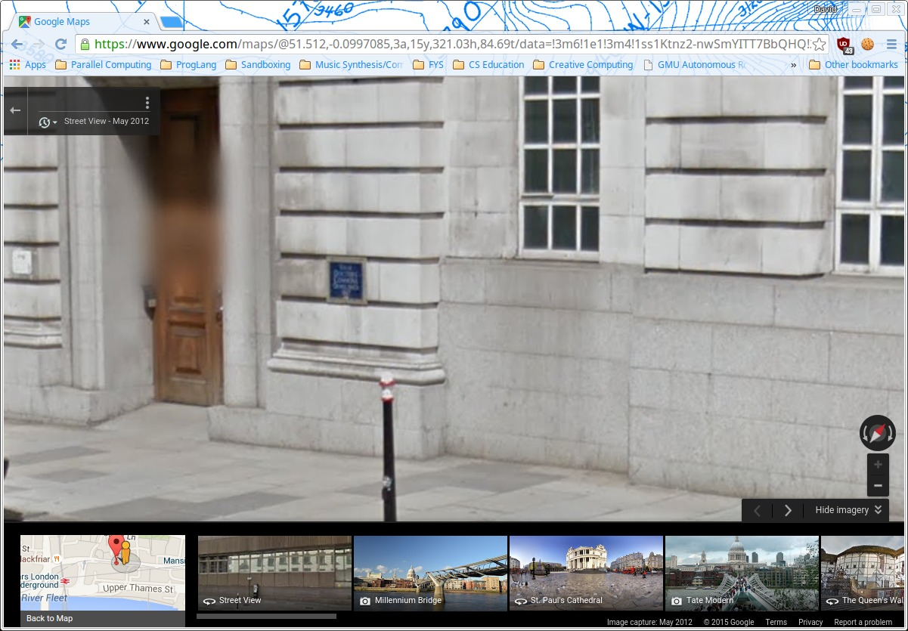

# Learning goals

* Explore electronic maps as a way of understanding literature and history

# What to do

Choose a work of literature or a historical event that is connected to a particular place.

Use [Google Maps](https://www.google.com/maps) to create an annotated Google Map in which you create location markers that document important locations and events from the literary work or historical event.

Here is a list of steps:

1. Think of a work of literature or historical event
2. Find some important locations related to the literatry work or event
3. Use Google Maps to find one or more of those locations: if possible, use Street View to see the actual streets and buildings
4. Create a Custom Google Map using [My Maps](https://www.google.com/maps/d/) (you will need to be signed into your YCP Google account)
5. Choose a name for your Custom Google Map
6. Choose a name for the "layer" of your Custom Google Map that you will use to create annotated locations
7. Add locations to your Custom Google Map; give each location a descriptive name, and annotate it with text describing its significance, including quote from the literary work (or historical account) if appropriate
8. Create a document called **Map Project** in your shared Google Drive folder.  In it, add the information described below.

Add the following information to your **Map Project** document:

* How accurate do you think your map is?  Describe ways in which it accurately depicts the literary work or historical event you chose, and describe ways in which it might be misleading.
* How have the places your map describes changed since the setting of the literary work (or the historical events) you chose?
* How do you think your map helps you understand the literary work or historical event?

See the *Example: London in David Copperfield* section below for an example of an annotated map created from a literary work.

## Example: London in David Copperfield

Much of [David Copperfield](https://www.gutenberg.org/ebooks/766) by Charles Dickens takes place in London.  I created a map with a few of the locations from the novel.  You can see the map here:

> <https://drive.google.com/open?id=1bQwYFUkVhoU6t5kph8bDTUoLhtI>

Note that you will need to be logged into your YCP Google account for the link to work.

I mapped three locations:

* Murdstone and Grinby's Warehouse 
* Doctors' Commons
* London Bridge

The exact location of Murdstone and Grinby's Warehouse is unclear, so I chose a locatation in Blackfriars, near the river.

In the case of Doctors' Commons, the building was demolished in 1867, and the Faraday Building (site of London's first telephone exchange) now occupies the space where the Doctors' Commons stood.  The [Doctors' Commons Wikipedia article](https://en.wikipedia.org/wiki/Faraday_Building) mentions that there is a plaque commemorating the Doctors' Commons:

> 

I was able to find this plaque on Google Street View (click for full size):

> 

One general comment on the map and its locations is that in many ways, modern London bears very little resemblence to the London of the early 1800's when the novel takes place.  However, a significant amount of architecture from the 19th century and earlier has survived, and this link does provide a connection to the setting of the novel.
