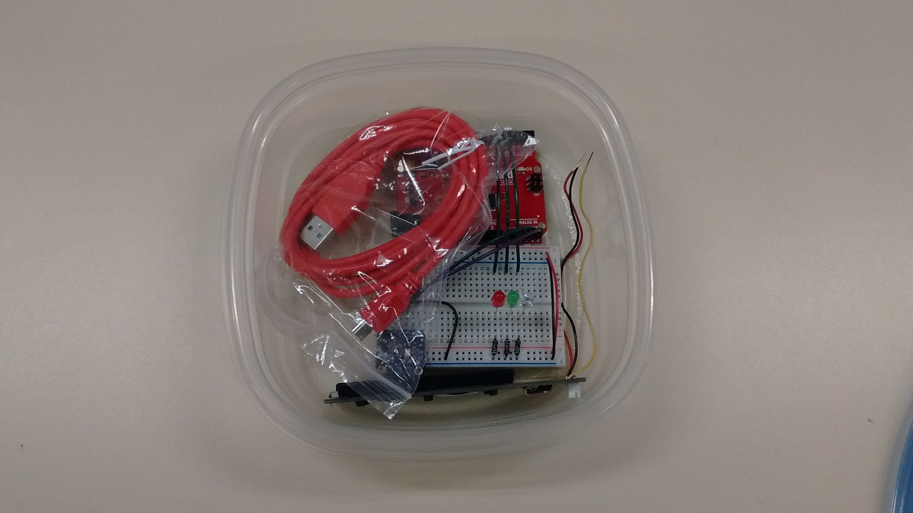
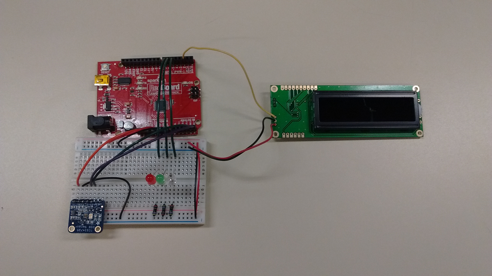
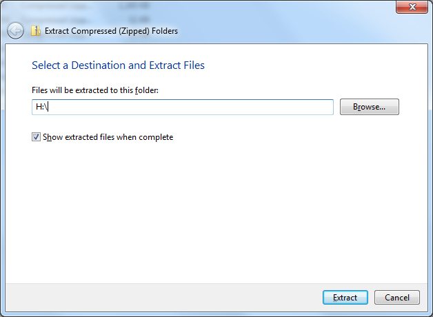

# Learning goals

* Learn about embedded systems and possible uses for them
* Experiment with sensors and actuators to control and monitor the environment

# What to do

In this lab we will experiment with writing programs for the Arduino, an embedded controller.

First, read the *Embedded controllers* and *Arduino* sections.  Then read the *Hardware setup* and *Software setup* sections to find out how to get started with the Arduino development software and the [SparkFun RedBoard](https://www.sparkfun.com/products/12757) hardware.  Next, read the *Arduino programs* section to learn about how Arduino programs work (they are very similar to Processing programs.)  Finally, read the *Quick experiments* and *Color sensor* sections for an explanation of the tasks you will work on.

## Embedded controllers

An *embedded controller* is a computer that is meant to be "embedded" in a larger device or system.  Unlike "standalone" computing devices such as PCs, laptops, tablets, and smartphones, where the software exists to serve the needs of a human user, software for embedded systems operates automonously.

There are a *huge* number of possible applications for embedded controllers.  In fact, you almost certainly use devices with embedded controllers every day.

A typical embedded controller uses *sensors* to monitor the physical environment and *actuators* to control the physical environment.  For example, an embedded controller in a coffeemaker could use a temperature sensor to keep track of the current water temperature, and activate/deactivate a heating element to keep the temperature at an optimum temperature for brewing coffee.

Most embedded controllers are not as powerful as a traditional computer.  This is because for many applications, the controller has a relatively simple task to perform, and a small amount of processing power is sufficient.

## Arduino

The [Arduino](https://www.arduino.cc/) is a very popular family of embedded controllers.  The [Arduino IDE](https://www.arduino.cc/en/Main/Software) is the software development environment, allowing you to write programs for Arduino controllers and upload them to the controller hardware.  The Arduino IDE is based on Processing, so it should seem quite familiar.  In fact, the way that programs are written for the Arduino is quite similar to Processing, as we will see.

The particular variation of Arduino we will be using is the [SparkFun RedBoard](https://www.sparkfun.com/products/12757), which is a clone of the [Arduino UNO](https://www.arduino.cc/en/Main/ArduinoBoardUno).

One thing you should understand about Arduino and embedded controllers in general is the distinction between the *host* and *target* computers.  The *host* is the PC you use to write the program to be executed on the embedded controller.  The *target* is the embedded controller itself.  When you are ready to run your program on the controller, you will need to upload the compiled program from the host computer to the target (controller.)  The good news is that the Arduino software makes this really easy to do.

## Hardware setup

For this lab, you will work in a group of 2 or 3.  Each group will use one hardware kit.

The hardware kit contains:

* A SparkFun RedBoard: this is the Arduino (compatible) controller
* A solderless breadboard, which contains a circuit with an [RGB color sensor](https://www.adafruit.com/products/1334) and three LEDs (one red, one green, and one blue)
* A [SparkFun serial 16x2 LCD](https://www.sparkfun.com/products/9395)
* A USB Mini-B cable

Here what the kit looks like (click for full size):

> 

You should carefully remove the components from the container.  Be careful to keep the wires connecting the RedBoard and the solderless breadboard intact.

You will need to connect the LCD to the other components as follows:

* The yellow wire should connect to Digital Output 2 on the RedBoard
* The black wire should connect to the ground (blue `-`) row of connections on the breadboard
* The red wire should connect to the +5V (red `+`) row of connections on the breadboard

When connected, the entire setup should look like this (click for full size):

> 

At this point, you can use the USB Mini-B cable to connect the RedBoard to the PC you are using.  Some LEDs should light up, and once the embedded program is running you should see the message `red`, `green`, or `blue` on the LCD.

## Software setup

Please follow these instructions very carefully.

Start by downloading the following zipfile:

> [arduino.zip](../media/arduino.zip)

Right-click on the zipfile and choose **Extract all...**.  Choose **H:\\** as the destination directory.  Make sure you see a dialog that looks like this:

> 

Next, start the **Arduino** program from the Windows start menu (**Start &rarr; Programs &rarr; Arduino**).  You should see a window that looks a lot like the Processing main window.  Choose **File &rarr; Preferences**.  In the preferences dialog, choose **H:\\arduino** as your sketchbook location.  Close the Arduino program and restart it.

When the Arduino program restarts, open **H:\\arduino\\RGBSensor\\RGBSensor.ino**.  You should now see the code for the **RGBSensor** program: this is the program that is running on the RedBoard.

Try compiling the program by clicking the Verify button.  It looks like this:

> 

If the program compiles successfully, you are ready to try uploading it into the board.  First, you will need to set the port that the host PC uses to communicate with the RedBoard.  Choose **Tools &rarr; Serial Port &rarr; COM3**.  Next, click the Upload button, which looks like this:

> 

If everything was successful, your program will be running on the target hardware.  Congratulations.

## Arduino programs

Arduino programs are very similar to Processing programs.  The `setup` function specifies code that executes once, when the program running on the target device starts.  In an Arduino program, `setup` typically initializes hardware devices.  The `loop` function is analogous to the Processing `draw` function: it executes repeatedly.  It typically reads values from sensors, interprets the data received, and uses the received data to control actuators or display devices.

The hardware circuit in our kits has one sensor and four display devices.  The sensor is an RGB color sensor, which determines the color of the light striking its sensing element.  The display devices are three LEDs and an LCD display.

To control the LEDs, the program controls the output voltages of several "output pins".  You will notice the following code in the `setup` function:


pinMode(7, OUTPUT); // red LED
pinMode(6, OUTPUT); // green LED
pinMode(5, OUTPUT); // blue LED


This code sets digital I/O pins 5, 6, and 7 to output mode, where the program will control a voltage on each respective pin.  These pins control the red, green, and blue LEDs.

In the `setup` function you will notice code such as


digitalWrite(7, LOW);


and


digitalWrite(7, HIGH);


The `digitalWrite` function sets the voltage on a digital output pin to a low or high voltage.  In the circuit used by our kits, a high voltage will turn on the LED connected to the specified output pin, and a low voltage will turn off the LED.

## Quick experiments

Here are a few quick experiments you can do to learn about how to use and control the devices connected to the RedBoard.

Start by commenting out the code in the `loop` function by adding a line with the text "`/*`" at the beginning of the function (just after the opening "`{`"), and a line with the text "`*/`" at the end of the function (just before the closing "`}`".)

**First experiment**.  Add the following code to the `loop` function:


static int count = 0;

digitalWrite(7, LOW);
digitalWrite(6, LOW);
digitalWrite(5, LOW);
if (count == 0) { 
  digitalWrite(7, HIGH);
} else if (count == 1) {
  digitalWrite(6, HIGH);
} else {
  digitalWrite(5, HIGH);
}

count++;
if (count > 2) {
  count = 0;
}

delay(500);


What do you think this code will do?  Try running it.  Then, try changing the code to create different effects with the LEDs.

**Second experiment**.  Comment out the code from the first experiment.  Then, add the following code:


static int count = 0;

clearLCD();
for (int i = 0; i < count; i++) {
  lcd.write(" ");
}
lcd.write("X");

count++;
if (count > 31) {
  count = 0;
}

delay(500);


What do you think this code will do?  Try running it.  Then, try changing the code to create different effects with the LCD.

**Third experiment**.  Comment out the code from the second experiment.  Then, add the following code:


uint16_t r, g, b, c;
  
tcs.getRawData(&r, &g, &b, &c);

clearLCD();
lcd.print("R:");
lcd.print(r, DEC);
lcd.write(254);
lcd.write(136);
lcd.print("G:");
lcd.print(g, DEC);
lcd.write(254);
lcd.write(192);
lcd.print("B:");
lcd.print(b, DEC);

delay(250);


What do you think this code will do?  Try running it.  *Hint*: try holding different color objects in front of the RGB color sensor.  How do the values shown on the LCD change?

## Color sensor

The goal of the program is identify colors.

The RGB Color sensor (the small circuit board with the bright white LED in the lower-left corner of the breadboard) detects the color of the light striking its light-sensing element.  Specifically, it detects colors by determining the relative intensity of the red, green, and blue components of the light striking the element.  As you may recall from [Lab 1](lab01.html), any visible color can be specified as a combination of red, green, and blue intensities.

TODO: more explanation.

<!-- vim:set wrap: ­-->
<!-- vim:set linebreak: -->
<!-- vim:set nolist: -->
